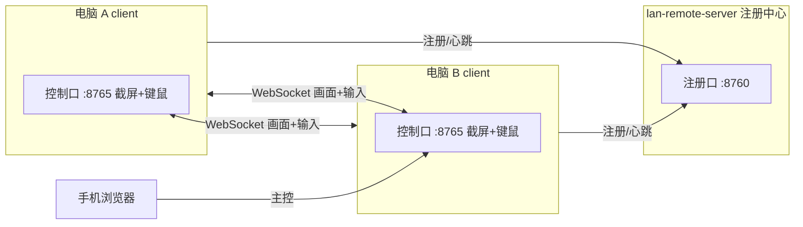

# LAN Remote

局域网远程桌面控制。Windows / Linux 互控，手机浏览器可作主控端。

**下载安装包 → [Releases](https://github.com/hyc-yuchen/lan-remote/releases/latest)**



## 组件

| 程序 | 角色 | 端口 |
|------|------|------|
| `lan-remote-server` | 注册中心 + 统一入口门户（不把自己注册为可被控设备） | TCP **8760** 注册 · **8765** 门户 |
| `lan-remote-client` | 每台电脑：可被控 + 可主控 | TCP **8765** |

- **Server** 不截屏、不注入输入；维护设备目录，并提供网页门户与控制代理。
- **Client** 设置本机 PIN、填 Service IP；既可被别人控，也可控制别人。
- 多网卡会注册全部 IPv4；连接时自动尝试，不含 `127.0.0.1`。

## 快速开始

从 **[Releases](https://github.com/hyc-yuchen/lan-remote/releases/latest)** 下载：

| 文件 | 说明 |
|------|------|
| `lan-remote-server.exe` | 中心机（注册中心 + 门户）Windows |
| `lan-remote-client.exe` | 各电脑 Windows |
| `lan-remote-server-linux` / `lan-remote-client-linux` | Linux |
| `open-firewall.bat` | 防火墙放行（管理员运行） |

### 1. 中心机

```bat
lan-remote-server.exe
```

- 管理页：`http://中心机IP:8760`
- 统一控制入口：`http://中心机IP:8765`（手机/浏览器用这个）

### 2. 各电脑

```bat
lan-remote-client.exe
```

首次启动：

1. 设置本机 **PIN**（可随机生成，会保存）
2. 填 **Service IP**（中心机 IP，如 `192.168.1.10`）
3. 启动

之后在「局域网设备」点对方 → 输对方 PIN → 远程控制。

### 3. 手机

与电脑同一 Wi-Fi，打开：

```
http://中心机IP:8765
```

列表选设备或手动连接 `目标IP:8765` + PIN。

## 功能

- 实时屏幕推流（JPEG/WebSocket），画质 1–100、帧率最高 120
- 鼠标、键盘、中文文字注入
- 触摸：点按左键、长按右键、双指滚动
- 远程全屏
- **文件互传**：双栏（本机 ↔ 远端），可浏览远端全部磁盘/目录，上传到当前目录、勾选下载
- 设备注册与心跳（约 20 秒下线）
- Windows 托盘：关窗进托盘，菜单/双击可重新打开
- `-bg` 后台模式（日志写文件，无控制台）
- Server 管理页（:8760）与统一门户（:8765）
- 分辨率自适应与 DPI 感知

## 命令行

**server**

| 参数 | 默认 | 说明 |
|------|------|------|
| `-port` | 8760 | 注册口 |
| `-portal` | 8765 | 门户口 |
| `-no-gui` | false | 不建窗口 |
| `-bg` | false | 后台运行 |

**client**

| 参数 | 默认 | 说明 |
|------|------|------|
| `-port` | 8765 | 控制口 |
| `-pin` | （空） | 本机 PIN |
| `-hub` | （空） | Service `host[:port]`，也可在界面填 |
| `-q` / `-fps` | 70 / 15 | 画质 / 帧率 |
| `-no-gui` / `-bg` | false | 无窗口 / 后台 |

## 配置文件

| 平台 | 路径 |
|------|------|
| Windows | `%APPDATA%\lan-remote\server.json`、`client.json` |
| Linux | `~/.config/lan-remote/` |

## 平台说明

| 平台 | 被控 | 主控 |
|------|------|------|
| Windows | ✅ | ✅ 原生窗口（WebView2） |
| Linux X11 | ✅ 需 `scrot` 或 ImageMagick，以及 `xdotool` | ✅ |
| Android / iOS | ❌ 需另写原生 App | ✅ 浏览器打开 `:8765` |
| Wayland | ❌ 全局截屏受限 | ✅ |

Linux 依赖：

```bash
sudo apt install scrot imagemagick xdotool
```

Windows WebView2：Win10/11 一般自带。

## 后台运行

**Windows**

- 关窗 → 托盘；托盘菜单「显示窗口」或双击图标
- `-bg`：无控制台，日志写临时目录

**Linux**

```bash
./lan-remote-server -bg
# 或
nohup ./lan-remote-server -bg >/dev/null 2>&1 &
```

有桌面会话时也可托盘；无桌面纯后台。

## 防火墙

- TCP **8765**（控制 / 门户）
- TCP **8760**（注册 / 管理页）

可用 `open-firewall.bat`（管理员）一键放行 Private/Domain。

若同网仍连不上，检查路由器「AP 隔离 / 访客隔离」。

### SmartScreen

首次运行未签名 exe 可能被 Windows SmartScreen 拦截：点 **更多信息 → 仍要运行**。这是未代码签名导致，不是程序故障。

## 从源码构建

需要 Go 1.21+。

```bash
git clone https://github.com/hyc-yuchen/lan-remote.git
cd lan-remote

go build -ldflags "-s -w -H windowsgui" -o dist/lan-remote-server.exe ./cmd/server
go build -ldflags "-s -w -H windowsgui" -o dist/lan-remote-client.exe ./cmd/client

GOOS=linux GOARCH=amd64 CGO_ENABLED=0 go build -ldflags "-s -w" -o dist/lan-remote-server ./cmd/server
GOOS=linux GOARCH=amd64 CGO_ENABLED=0 go build -ldflags "-s -w" -o dist/lan-remote-client ./cmd/client
```

或 `make server client`。

预编译包请到 **[Releases](https://github.com/hyc-yuchen/lan-remote/releases)** 下载。

重新生成图标：

```bash
go run tools/genicon/main.go
# 再用 rsrc 生成 cmd/*/rsrc.syso
```

## 目录结构

```
cmd/server/          注册中心 + 门户入口
cmd/client/          端侧入口（截屏 + 控制 UI）
internal/capture/    屏幕截取（Win / Linux）
internal/inject/     键鼠注入
internal/registry/   注册中心与客户端、管理页
internal/portal/     统一门户与 WS/文件代理
internal/server/     HTTP + WebSocket 控制协议 + 内嵌网页
internal/config/     配置读写
internal/appwin/     窗口 / 托盘 / 图标
internal/tray/       系统托盘
web/                 网页源码（构建时 embed）
tools/genicon/       生成 ICO
```

## 协议简述

1. Client 向 `POST /api/register` 或 `/api/heartbeat` 上报名称与全部 IP。
2. 其他端 `GET /api/devices` 拉取在线列表。
3. 主控连 `ws://目标:8765/ws`，先发 `{"type":"auth","pin":"..."}`。
4. 鉴权通过后服务端推 JPEG 二进制帧；客户端发 `move` / `button` / `key` / `text` / `scroll`。
5. 文件：`POST /api/file` 上传，`GET /api/files` 列目录，`GET /api/download` 下载（需 PIN）。

## 安全说明

- PIN 用于同网设备互认；请勿把端口直接暴露到公网。
- 修改本机 PIN 仅允许回环访问。
- 远端文件浏览无目录沙箱，PIN 通过即可访问本机任意路径——请仅在受信局域网使用。
- 未使用 TLS；跨不可信网络请自行加 VPN/隧道。

## License

MIT
