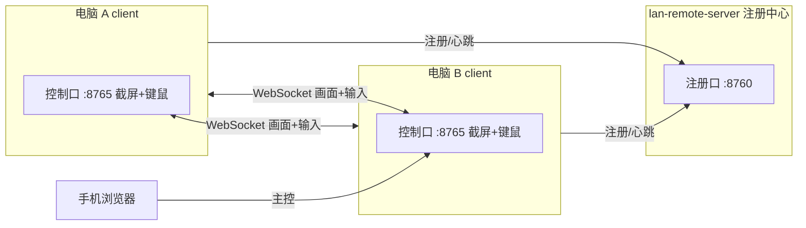

# LAN Remote

局域网远程桌面控制。Windows / Linux 互控，手机浏览器可作主控端。



## 组件

| 程序 | 角色 | 端口 |
|------|------|------|
| `lan-remote-server` | 注册中心 / Service，只负责设备目录 | TCP **8760** |
| `lan-remote-client` | 每台电脑上的端：可被控 + 可主控 | TCP **8765** |

- **Server** 不截屏、不注入输入，只维护在线设备列表。
- **Client** 启动后设置本机 PIN、填 Service IP；既可被别人控，也可在界面里控别人。
- 多网卡机器会注册**全部 IPv4**，连接时自动逐个尝试。

## 快速开始

### 1. 启动注册中心（一台常开的电脑）

```bat
lan-remote-server.exe
```

记下屏幕上的 Address，例如 `http://192.168.1.10:8760`。

### 2. 每台参与的电脑启动 Client

```bat
lan-remote-client.exe
```

首次启动在窗口里：

1. 设置本机 **PIN**（可「随机生成」）
2. 填 **Service IP**（注册中心 IP，如 `192.168.1.10`）
3. 点「启动」

之后在「局域网设备」里点对方 → 输入对方 PIN → 远程控制。

### 3. 手机主控

手机与电脑同一 Wi‑Fi，浏览器打开某台 Client：

```
http://电脑IP:8765
```

远程访问会进入控制端模式，在列表中选设备，或「手动连接」填 `目标IP:8765` + PIN。

## 命令行参数

**server**

| 参数 | 默认 | 说明 |
|------|------|------|
| `-port` | 8760 | 注册口 |

**client**

| 参数 | 默认 | 说明 |
|------|------|------|
| `-port` | 8765 | 控制口 |
| `-pin` | （空） | 本机 PIN，会写入配置 |
| `-hub` | （空） | Service `host[:port]`，也可在界面填 |
| `-q` / `-fps` | 70 / 15 | 画质与帧率 |
| `-no-gui` | false | 不建窗口，用浏览器打开 UI |

## 配置文件

| 平台 | 路径 |
|------|------|
| Windows | `%APPDATA%\lan-remote\server.json` / `client.json` |
| Linux | `~/.config/lan-remote/` |

PIN 与 Service 地址保存在配置里，下次启动自动加载。

## 功能

- 实时屏幕推流（JPEG / WebSocket，可调画质与 FPS）
- 鼠标移动 / 左右键 / 滚轮，键盘与中文文字注入
- 手机触控：点按左键、长按右键、双指滚动
- 设备自动注册与心跳（约 20s 下线）
- Windows 原生窗口（WebView2），无黑框控制台
- 分辨率自适应（DPI 感知截屏 + 画布等比缩放）

## 平台说明

| 平台 | 被控 | 主控 |
|------|------|------|
| Windows | ✅（Win32 BitBlt + SendInput） | ✅ |
| Linux X11 | ✅（需 `scrot` 或 ImageMagick，以及 `xdotool`） | ✅ |
| Android / iOS | ❌（需另写原生 App） | ✅ 浏览器访问 `:8765` |
| Wayland | ❌ 全局截屏受限 | ✅ |

### Linux 依赖

```bash
sudo apt install scrot imagemagick xdotool
```

### Windows WebView2

Client 窗口依赖 [WebView2 Runtime](https://developer.microsoft.com/microsoft-edge/webview2/)（Win10/11 一般自带）。

## 防火墙

放行：

- TCP **8765**（控制）
- TCP **8760**（注册）

仓库内 `open-firewall.bat` 可**以管理员身份运行**一键放行（Private/Domain）。

同网若仍连不上，检查路由器是否开启「AP 隔离 / 访客隔离」。

## 从源码构建

需要 [Go](https://go.dev/dl/) 1.21+。

```bash
git clone https://github.com/hyc-yuchen/lan-remote.git
cd lan-remote

# Windows
go build -ldflags "-s -w -H windowsgui" -o dist/lan-remote-server.exe ./cmd/server
go build -ldflags "-s -w -H windowsgui" -o dist/lan-remote-client.exe ./cmd/client

# Linux
GOOS=linux GOARCH=amd64 CGO_ENABLED=0 go build -ldflags "-s -w" -o dist/lan-remote-server ./cmd/server
GOOS=linux GOARCH=amd64 CGO_ENABLED=0 go build -ldflags "-s -w" -o dist/lan-remote-client ./cmd/client
```

或：

```bash
make server client
```

预编译包见 [`release/`](release/) 目录。

## 安全说明

- PIN 仅用于同网设备互认，**不要**把控制口直接暴露到公网。
- 修改 PIN 的接口仅允许本机回环访问。
- 未使用 TLS；跨不可信网络请自行加 VPN / 隧道。

## 目录结构

```
cmd/server/          注册中心入口
cmd/client/          端侧入口（截屏 + 控制 UI）
internal/capture/    屏幕截取（Win / Linux）
internal/inject/     键鼠注入
internal/registry/   注册中心服务与客户端
internal/server/     HTTP + WebSocket 控制协议 + 内嵌网页
internal/config/     配置读写
internal/appwin/     WebView2 / 浏览器窗口
web/                 网页源码（构建时 embed）
release/             发布二进制
```

## 协议简述

1. Client 向 `POST /api/register`（或心跳 `/api/heartbeat`）上报名称与全部 IP。
2. 其他端 `GET /api/devices` 拉取在线列表。
3. 主控连 `ws://目标:8765/ws`，先发 `{"type":"auth","pin":"..."}`。
4. 鉴权通过后服务端推 JPEG 二进制帧；客户端发 `move` / `button` / `key` / `text` / `scroll` JSON。

## License

MIT
